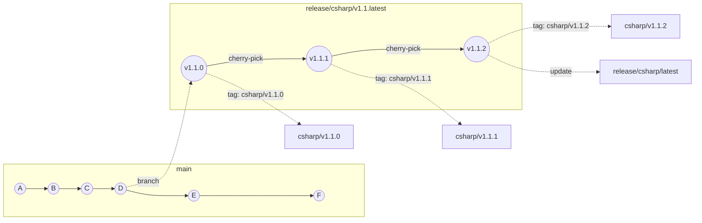

<!--
  Copyright (c) 2025 ADBC Drivers Contributors

  Licensed under the Apache License, Version 2.0 (the "License");
  you may not use this file except in compliance with the License.
  You may obtain a copy of the License at

          http://www.apache.org/licenses/LICENSE-2.0

  Unless required by applicable law or agreed to in writing, software
  distributed under the License is distributed on an "AS IS" BASIS,
  WITHOUT WARRANTIES OR CONDITIONS OF ANY KIND, either express or implied.
  See the License for the specific language governing permissions and
  limitations under the License.
-->

# C# Driver Release Process

## Overview

The C# driver uses a release branch model because downstream consumers (e.g., PowerBI) ship a specific driver version and cannot freely upgrade. When PowerBI ships `v1.0.0`, they may remain on that version for months. If a bug is found, they need a `v1.0.1` hotfix delivered to their `v1.0.x` release line — without being forced to take new features from `v1.1.x` or later.

This means **multiple release branches coexist simultaneously**, each independently maintainable via cherry-picks:

```
release/csharp/v1.0.latest:  [v1.0.0] → cherry-pick fix → [v1.0.1] → cherry-pick fix → [v1.0.2]
release/csharp/v1.1.latest:  [v1.1.0] → cherry-pick fix → [v1.1.1]
release/csharp/v1.2.latest:  [v1.2.0]
```

Each branch is a **moving pointer** — it advances with every patch. Tags (`csharp/v1.0.1`, `csharp/v1.0.2`) mark the immutable points corresponding to each published NuGet package.

The ADBC driver version is included in the user agent string sent to Databricks, making it visible in query history for tracing exactly which version a consumer is running.

## Branch and Tag Naming

| Artifact | Pattern | Example |
|----------|---------|---------|
| Release branch | `release/csharp/vX.Y.latest` | `release/csharp/v1.1.latest` |
| Release tag | `csharp/vX.Y.Z` | `csharp/v1.1.2` |
| Latest branch | `release/csharp/latest` | — |

The branch name uses `latest` rather than a patch version because the branch moves forward with each patch. The tag is the permanent, immutable record of each published version.

## Versioning Rules

| Version bump | When to use | Examples |
|---|---|---|
| **Patch** `v1.1.0 → v1.1.1` | Bug fixes, security patches, performance improvements with no API changes. Safe to deliver to consumers already on `v1.1.x` with zero config changes. | Fix token refresh bug, fix connection timeout |
| **Minor** `v1.1.x → v1.2.x` | New features, new connection parameters, new opt-in behavior. Consumers need to explicitly upgrade and may need to test. | New auth method, new query option |
| **Major** `v1.x → v2.0.x` | Breaking changes — removed parameters, changed defaults, incompatible behavior. | Rename required parameter, change default protocol |

**Practical rule**: if PowerBI can drop in the new NuGet package with zero config changes and it just works, it's a patch. If they need to test it, update config, or it changes observable behavior, it's at least a minor bump.

### Current vs older release branches

- **Current release branch** (e.g. `v1.1.latest` is the latest): sync directly from `main` for patch fixes, then tag.
- **Older release branches** (e.g. `v1.0.latest` when `v1.1.latest` exists): cherry-pick specific fixes only — do not pull all of `main` as it would bring in unwanted features from newer minor versions.

## Lifecycle



### Releasing a new version

For any version bump (patch, minor, or major) on the **current** release line:

1. Open a PR on `main` that bumps `VersionPrefix` in `csharp/Directory.Build.props` and updates `csharp/CHANGELOG.md`.

   | Bump type | Example | Branch result |
   |-----------|---------|---------------|
   | Patch | `1.1.0` → `1.1.1` | Updates existing `release/csharp/v1.1.latest` |
   | Minor | `1.1.x` → `1.2.0` | Creates new `release/csharp/v1.2.latest` |
   | Major | `1.x` → `2.0.0` | Creates new `release/csharp/v2.0.latest` |

2. Merge the PR. CI automatically:
   - Pushes `main` to the matching `release/csharp/vX.Y.latest` (creating it if new)
   - Tags the tip as `csharp/vX.Y.Z`
   - Updates `release/csharp/latest`

For **older** release branches (e.g. `v1.0.latest` when `v1.1.latest` exists), automation does not apply — cherry-pick the fix directly onto the older branch and tag manually:
   ```bash
   git checkout release/csharp/v1.0.latest
   git cherry-pick <fix-commit>
   git push origin release/csharp/v1.0.latest
   git tag csharp/v1.0.2
   git push origin csharp/v1.0.2
   ```

## Branch Protection

All `release/csharp/*` branches (including `release/csharp/latest`) are protected by a single branch protection rule with pattern `release/csharp/*`:

- Deletion blocked
- 1 PR approval required
- Force pushes allowed (required for updating `release/csharp/latest`)

## Scope

This applies **only to the C# driver**. Other drivers in the monorepo are unaffected:

| Driver | Release Mechanism | Can hotfix old patch? |
|--------|------------------|-----------------------|
| **C#** | Release branches + tags | Yes — each minor version has its own branch |
| **Go** | Tags on `main` (`go/v0.1.x`) | No — consumers must upgrade |
| **Rust** | None | — |

The release branch contains the full monorepo (Git doesn't support partial branches), but only C# changes are cherry-picked and built from it.

## Latest Branch

`release/csharp/latest` always points to the tip of the most recent release branch. It is updated automatically by the `csharp-sync-latest.yml` workflow on every push to `main` that bumps `csharp/Directory.Build.props`. The workflow reads `VersionPrefix`, pushes `main` to the matching `release/csharp/vX.Y.latest` branch, and force-pushes that branch to `release/csharp/latest`.

## CI/CD

- `csharp.yml` — runs build and tests on PRs targeting and pushes to `release/csharp/*` branches
- `csharp-sync-latest.yml` — triggers on every push to `main` that changes `csharp/Directory.Build.props`; reads `VersionPrefix`, pushes `main` to the matching `release/csharp/vX.Y.latest` (creating it if new), tags the tip as `csharp/vX.Y.Z`, and force-updates `release/csharp/latest`

## Consumer Mapping (e.g., PowerBI)

- **Track a release branch** (e.g., `release/csharp/v1.1.latest`) — receives cherry-picks automatically, pinned to a specific minor version line
- **Pin to a tag** (e.g., `csharp/v1.1.2`) — frozen at an exact published version
- **Track `release/csharp/latest`** — always tracks the tip of the most recent release
